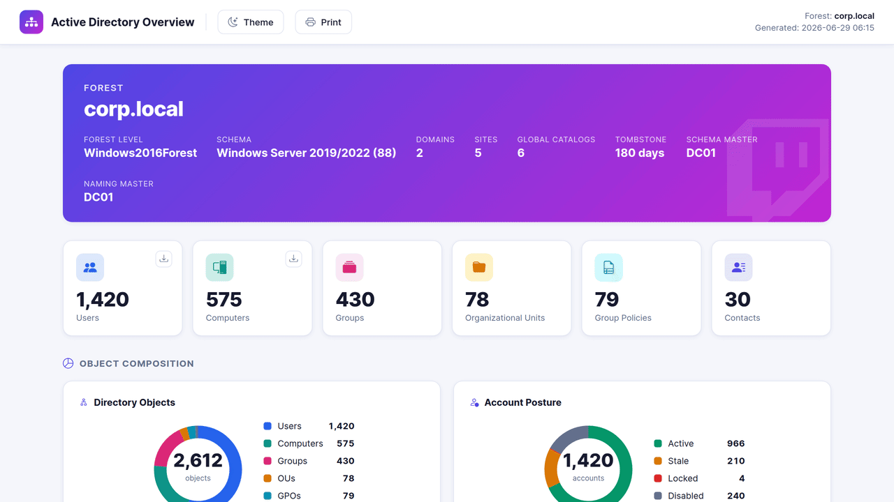
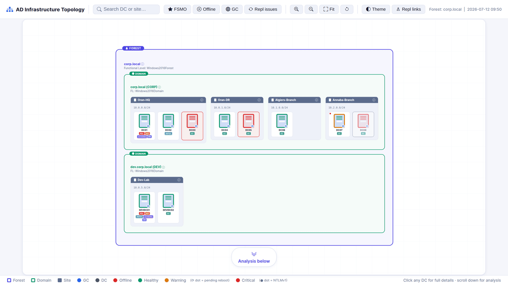
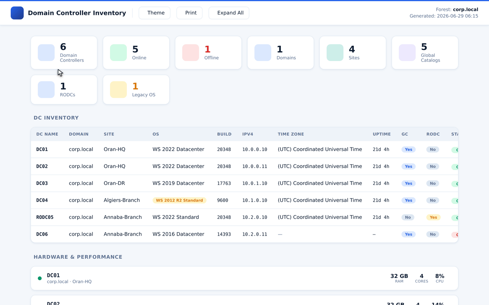

# Active Directory Audit Suite

> A growing collection of standalone PowerShell scripts that each produce a single, self-contained, interactive HTML report for a different area of Active Directory health and security.

Every module is one script. Run it on a domain-joined machine with the AD PowerShell module, and it discovers the live environment and writes **one HTML file** you can open in any browser — no agents, no install, no internet, no telemetry. Each report is fully offline and portable: drop it in a ticket, attach it to an email, or hand it to an auditor.

---

## Modules

| Module | Script | What it covers |
|---|---|---|
| **Overview** | \`AD-Overview.ps1\` | Forest & domain facts, object inventory, account posture, OS distribution, group breakdown |
| **Topology** | \`AD-Topology.ps1\` | Forest → domain → site → DC hierarchy with health, FSMO roles, services, replication links, dcdiag |
| **DC Inventory** | \`AD-DCInventory.ps1\` | Per-DC inventory plus hardware & performance specs (CPU, RAM, disks, NICs) |

Each module has its own distinct visual design so reports are instantly recognisable.

---

## Overview

The forest-wide summary — the natural landing page for the whole audit. Hero banner with forest facts (functional level, schema version, FSMO masters, tombstone lifetime), object-count KPI cards, donut charts for directory objects and account posture, bar charts for computer OS distribution and group breakdown, and a per-domain comparison table.

Stat cards that represent a list of objects (enabled / disabled / stale / never-logged-on / locked / password-never-expires accounts, computers, and security / distribution / scoped groups) include a **download icon** that exports that exact list to CSV — Name, SamAccountName, Enabled, LastLogon, and DN — entirely client-side, straight from the report.

\`\`\`powershell
.\scripts\AD-Overview.ps1
\`\`\`

---

## Topology

An interactive, pannable/zoomable map of the forest. Nested cards for forest → domain → site → DC, colour-coded by health. Click anything for a slide-in detail panel: forest info, domain FSMO holders, site subnets, or a rich DC panel with services, resources, replication status, and dcdiag results. Toggleable inter-site replication link overlay with cost and frequency labels.

The toolbar also opens three analysis panels:

- **Replication Health Matrix** — a directional source → destination grid of every DC partnership across **every domain in the forest**, built from the replication metadata AD already tracks. It checks **all naming contexts** (domain, Configuration, Schema, DomainDnsZones, ForestDnsZones), not just the default partition, and each cell shows the **worst** partition — so a pair that is healthy on the domain NC but failing on Configuration still shows as failing. Click any cell for the full per-partition breakdown. Reads over ADWS (TCP 9389) and falls back to `repadmin`/RPC when ADWS is unreachable. "Delayed" thresholds are site-aware (`-ReplDelayIntraSiteHours`, default 1; `-ReplDelayInterSiteHours`, default 6) so healthy inter-site partners on the standard 180-minute schedule aren't flagged. Passive; no network probing.
- **Stale / Lingering Objects** — a read-only scan of the Configuration partition and Sites & Services for orphaned DC metadata, empty sites, sites without subnets, unlinked subnets, and lingering replication connections — each with the recommended remediation.

\`\`\`powershell
.\scripts\AD-Topology.ps1
\`\`\`

---

## DC Inventory

Per-DC inventory plus deep hardware and performance detail. KPI cards for online/offline/GC/RODC/legacy-OS counts, a full inventory table (name, domain, site, OS, build, IPv4, time zone, uptime, GC, RODC, status), and an expandable card per DC with System (manufacturer, model, BIOS, RAM), Performance (CPU/memory usage, AD database size), Processors, Logical Volumes with usage bars, and Network Adapters.

\`\`\`powershell
.\scripts\AD-DCInventory.ps1
\`\`\`

---

## Common parameters

Every module accepts:

| Parameter | Default | Description |
|---|---|---|
| \`-OutputPath\` | current directory | Folder to write the HTML report to |
| \`-OpenReport\` | \`\$true\` | Open the report in the default browser when finished |

Some modules add their own (\`-StaleDays\` on Overview, \`-SkipHardware\` on DC Inventory). Run \`Get-Help .\scripts\<script>.ps1 -Full\` for details.

> **Execution policy:** if a script is blocked, run it for the current process only:
> \`\`\`powershell
> powershell -ExecutionPolicy Bypass -File .\scripts\AD-Overview.ps1
> \`\`\`

---

## Requirements

| Requirement | Notes |
|---|---|
| Windows with **RSAT: Active Directory PowerShell** | \`Import-Module ActiveDirectory\` must work |
| **Domain-joined** machine (or one that can reach a DC) | Read-only AD queries |
| PowerShell **5.1+** | Windows PowerShell or PowerShell 7 |
| Account with **read access** to AD | No write operations are performed |

For the richest per-DC detail (Topology and DC Inventory), the running account should be able to reach the DCs via **WinRM** or **WMI/DCOM**. When a DC can't be reached, the report degrades gracefully and shows the fields it could not collect as *unavailable* rather than failing.

---

## Sample reports

The [\`examples/\`](examples/) folder contains a sample HTML report for each module, built from **fictional data** (\`corp.local\`). Open any of them in a browser to explore the interactive features without running anything.

---

## Read-only & safe to run

- Every module performs **read-only** AD and DC queries. Nothing is modified in Active Directory, Group Policy, or on any domain controller.
- The generated HTML is **fully self-contained and offline** — no external scripts, no trackers, no network calls when opened.
- Each script writes **only** its single HTML report to your chosen \`-OutputPath\`. Nothing else is created or changed.
- No credentials, passwords, or tokens are stored or transmitted.

The reports contain infrastructure detail (domain/DC names, IPs, group memberships, etc.), so treat them as confidential and store/share them accordingly.

---

## Part of a larger project

These three modules are the first release of an ongoing Active Directory Audit Suite. Additional modules covering other areas of AD health and security are in development and will be published here one by one. The long-term goal is a single orchestrator that runs all modules together and produces a comprehensive combined report.

Watch or ⭐ the repo to catch new modules as they land.

---

## Author

**Mohamed ZEGHLACHE** — Hybrid Cloud Engineer.

If this is useful, a ⭐ on the repo is appreciated, and feedback / issues are welcome.
