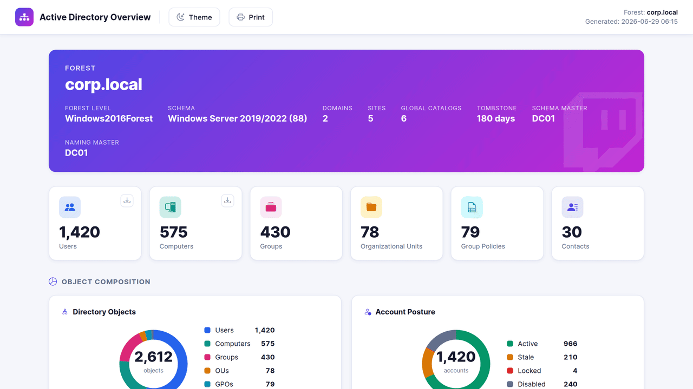
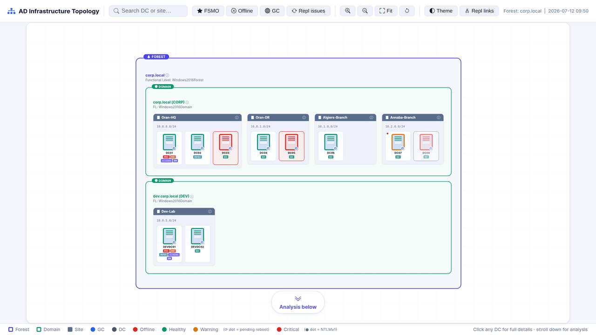
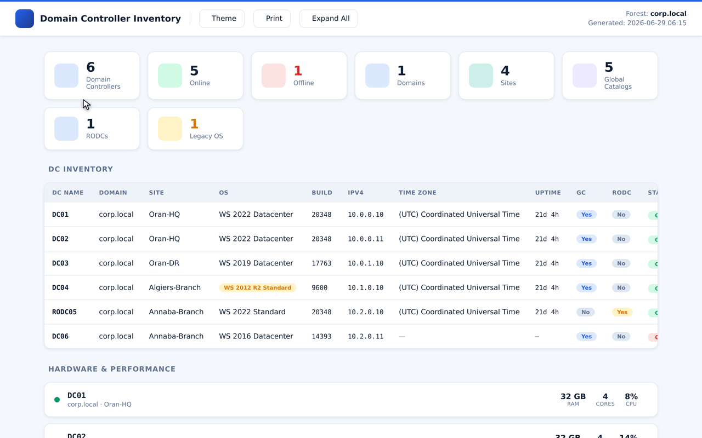
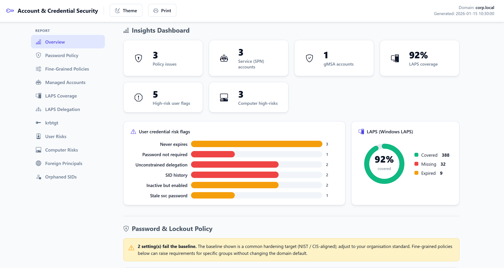
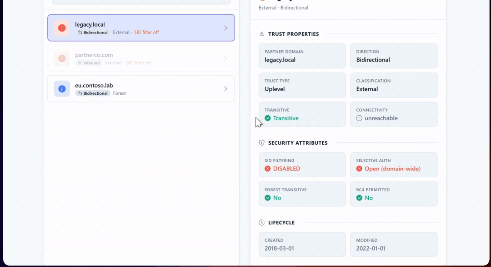
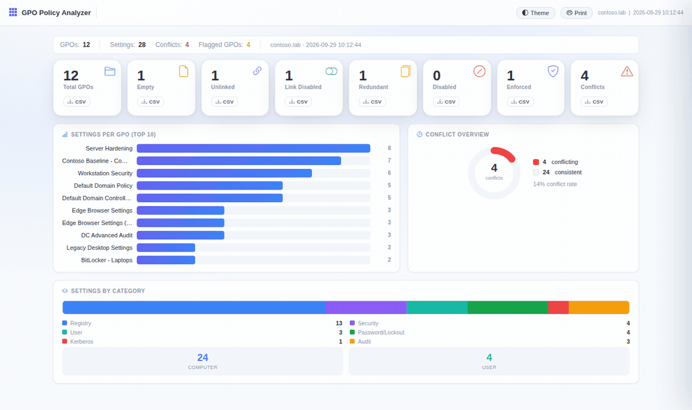
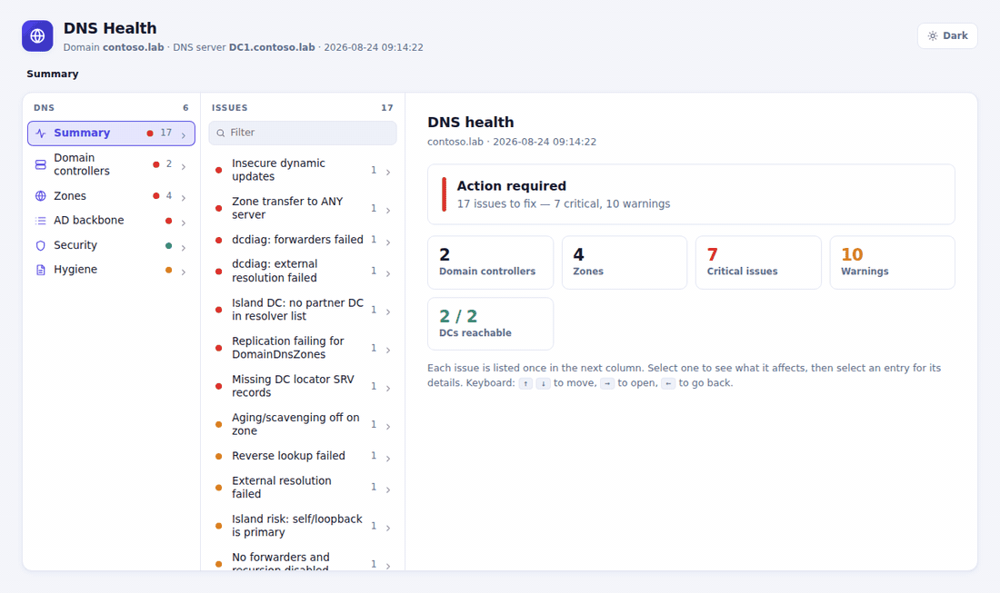
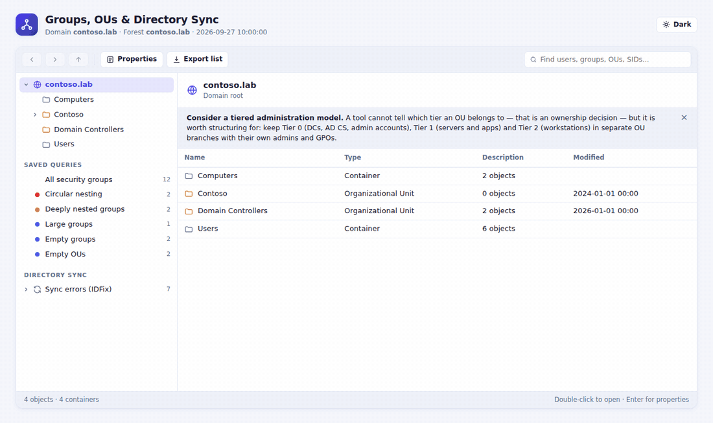
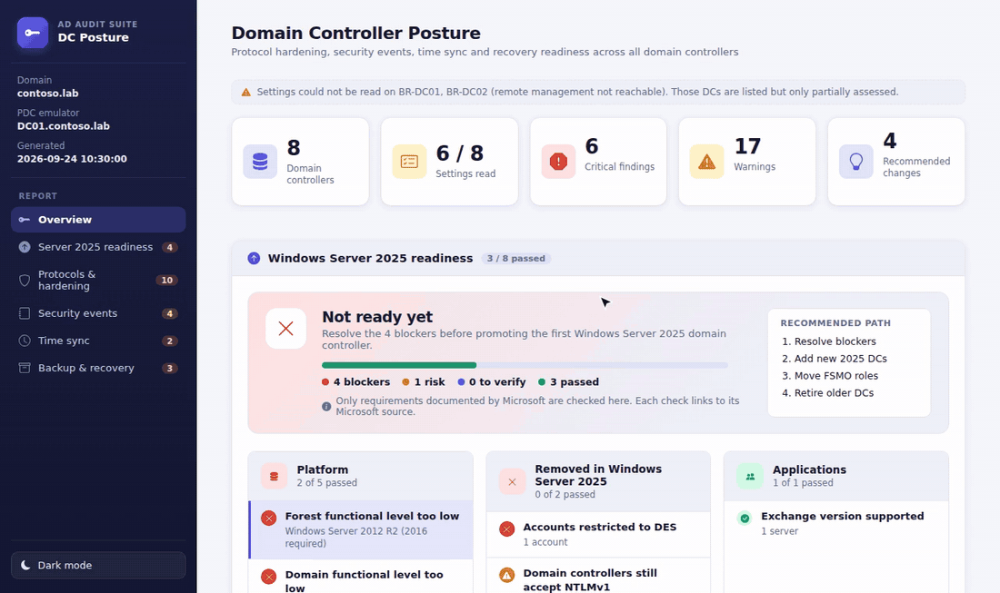

# Active Directory Audit Suite

<p align="center">
  
  
  
  
  
  <a href="LICENSE"></a>
</p>
<p align="center">
  <a href="https://github.com/Mohamed-Zeghlache/AD-Assessment-PowerShell-Script/stargazers"></a>
  
</p>
<p align="center">
  <a href="https://mohamed-zeghlache.net"></a>
  <a href="https://www.linkedin.com/in/mohamed-zeghlache"></a>
</p>

> A growing collection of standalone PowerShell scripts that each produce a single, self-contained, interactive HTML report for a different area of Active Directory health and security.

Every module is one script. Run it on a domain-joined machine with the AD PowerShell module, and it discovers the live environment and writes **one HTML file** you can open in any browser — no agents, no install, no internet, no telemetry. Each report is fully offline and portable: drop it in a ticket, attach it to an email, or hand it to an auditor.

---

## Modules

| Module | Script | What it covers |
|---|---|---|
| **Overview** | `AD-Overview.ps1` | Forest & domain facts, object inventory, account posture, OS distribution, group breakdown |
| **Topology** | `AD-Topology.ps1` | Forest → domain → site → DC hierarchy across every domain, with health, FSMO roles, services, replication links, dcdiag, orphaned metadata and trusts to other forests |
| **DC Inventory** | `AD-DCInventory.ps1` | Per-DC inventory across every domain, plus hardware & performance specs (CPU, RAM, disks, NICs) |
| **Account Security** | `AD-AccountSecurity.ps1` | Password/lockout policy, fine-grained password policies, managed service accounts, LAPS coverage, risky user & computer accounts, accounts without AES keys, krbtgt age |
| **Trust Relationships** | `AD-TrustRelationships.ps1` | Every AD trust with direction/type/transitivity, SID filtering & selective auth posture, connectivity probe, derived risk findings, interactive trust map |
| **GPO Policy Analyzer** | `GPO-PolicyAnalyzer.ps1` | Backs up every GPO, parses Registry.pol/GptTmpl.inf directly, resolves settings via ADMX/ADML, flags every setting where GPOs disagree, and shows WMI filters that may explain them |
| **DNS Health** | `AD-DNSHealth.ps1` | Per-zone/per-server DNS configuration (AD-integration, dynamic updates, aging/scavenging, DNSSEC) plus live per-DC resolution health and lingering DC record detection |
| **Group & OU Structure** | `AD-GroupOUStructure.ps1` | Recursive group-nesting graph with circular-nesting/empty-group/large-group detection, OU hierarchy with per-OU counts and tiering recommendation, and an IDFix scan for Entra ID/M365 sync blockers |
| **DC Posture** | `AD-DCPosture.ps1` | Per-DC protocol/hardening checks (LDAP signing, SMB signing, NTLM, Kerberos encryption, etc.), security events (lockouts, failed logons, password spray), time-sync hierarchy, backup/recovery readiness, and Windows Server 2025 readiness |

Each module has its own distinct visual design so reports are instantly recognisable.

---

## Overview



The forest-wide summary — the natural landing page for the whole audit. Hero banner with forest facts (functional level, schema version, FSMO masters, tombstone lifetime), object-count KPI cards, donut charts for directory objects and account posture, bar charts for computer OS distribution and group breakdown, and a per-domain comparison table.

Stat cards that represent a list of objects (enabled / disabled / stale / never-logged-on / locked / password-never-expires accounts, computers, and security / distribution / scoped groups) include a **download icon** that exports that exact list to CSV — Name, SamAccountName, Enabled, LastLogon, and DN — entirely client-side, straight from the report.

```powershell
.\scripts\AD-Overview.ps1
```

---

## Topology



An interactive, pannable/zoomable map of the forest. Nested cards for forest → domain → site → DC, covering **every domain in the forest**, colour-coded by health. Click anything for a slide-in detail panel: forest info, domain FSMO holders, site subnets, or a rich DC panel with services, resources, replication status, and dcdiag results. Toggleable inter-site replication link overlay with cost and frequency labels. Trusts to other forests and external domains are shown on the forest card and in its detail panel.

A DC counts as reachable if it answers ping **or** any core DC port (LDAP, Kerberos, RPC, SMB, ADWS), so DCs with ICMP blocked are not mistaken for unreachable ones.

The toolbar also opens two analysis panels:

- **Replication Health Matrix** — a directional source → destination grid of every DC partnership across **every domain in the forest**, built from the replication metadata AD already tracks. It checks **all naming contexts** (domain, Configuration, Schema, DomainDnsZones, ForestDnsZones), not just the default partition, and each cell shows the **worst** partition — so a pair that is healthy on the domain NC but failing on Configuration still shows as failing. Click any cell for the full per-partition breakdown. Reads over ADWS (TCP 9389) and falls back to `repadmin`/RPC when ADWS is unreachable. "Delayed" thresholds are site-aware (`-ReplDelayIntraSiteHours`, default 1; `-ReplDelayInterSiteHours`, default 6) so healthy inter-site partners on the standard 180-minute schedule aren't flagged. Passive; no network probing.
- **Stale / Lingering Objects** — a read-only scan of the Configuration partition and Sites & Services for orphaned DC metadata (checked against the DCs of every domain in the forest), empty sites, sites without subnets, unlinked subnets, and lingering replication connections — each with the recommended remediation.

```powershell
.\scripts\AD-Topology.ps1
.\scripts\AD-Topology.ps1 -ForestName contoso.com   # optional: report on another (trusted) forest
```

---

## DC Inventory



Per-DC inventory plus deep hardware and performance detail. KPI cards for reachable/unreachable/GC/RODC/legacy-OS counts, a full inventory table (name, domain, site, OS, build, IPv4, time zone, uptime, GC, RODC, status), and an expandable card per DC with System (manufacturer, model, BIOS, RAM), Performance (CPU/memory usage, AD database size), Processors, Logical Volumes with usage bars, and Network Adapters. Reachability uses ping or any core DC port, and a DC that does not respond is reported as *unreachable from the audit host* rather than assumed to be down.

```powershell
.\scripts\AD-DCInventory.ps1
```

---

## Account Security



Credential hygiene across the domain. Scores the default password & lockout policy against a recommended baseline, lists fine-grained password policies (PSOs) with precedence and who they apply to, inventories managed service accounts (gMSA/sMSA) and LAPS coverage (Windows and Legacy), and flags risky accounts — password-never-expires, password-not-required, unconstrained delegation, SID history, inactive-but-enabled users, stale service-account passwords, accounts (and krbtgt) with no AES keys because their password predates AES support, stale/legacy/EOL-OS computers — plus krbtgt password age. Long lists stay off the main page behind per-category **Open** (full-page view) and **CSV download** actions so a large tenant stays readable. Optional sources (LAPS schema, KDS root key, etc.) degrade gracefully to "Not available" instead of failing.

Reading fine-grained password policies requires read access to the Password Settings Container (Domain Admins by default). When the running account cannot see them, the report says they **could not be verified** instead of reporting that none exist.

```powershell
.\scripts\AD-AccountSecurity.ps1
```

---

## Trust Relationships



Enumerates every AD trust and assesses its security posture: partner domain, direction (inbound/outbound/bidirectional), trust type (external/forest/realm/parent-child/tree-root), and transitivity, plus SID filtering (quarantine), selective authentication, TGT delegation, and forest-transitive flags. Each trust gets a live connectivity probe (degrading gracefully to "Unavailable / Not tested" in locked-down environments) and derived risk findings — SID filtering disabled on an external/forest trust, selective authentication off, stale trusts, and more. Includes KPI tiles, a filterable trust explorer with detail panel, and an interactive trust map.

```powershell
.\scripts\AD-TrustRelationships.ps1
```

---

## GPO Policy Analyzer



Automates what Microsoft's Policy Analyzer does manually. Backs up every GPO in the domain (or a chosen subset) to a local folder, then parses the raw `Registry.pol` and `GptTmpl.inf` files directly from each backup — no `Get-GPOReport`, no RSOP, no repeated AD calls. Registry key/value pairs are resolved to friendly policy names via the same ADMX/ADML definition files GPME uses, pivoted into one comparison table, and any setting where GPOs disagree is flagged — the same "conflict" concept Policy Analyzer highlights in yellow. When a GPO involved in a conflict has a **WMI filter**, the setting's detail pane shows the filter and its query, since a WMI-filtered GPO only applies where the query is true and the "conflict" may never reach the same computer. The export step is the only part that talks to AD/SYSVOL; re-running with `-SkipExport` re-analyzes the same backups instantly, even for large GPO counts.

```powershell
.\scripts\GPO-PolicyAnalyzer.ps1
```

---

## DNS Health



Reviews the DNS that underpins Active Directory from two angles. **Configuration** — per zone and per server: zone type, AD-integration, replication scope, dynamic-update mode, aging/scavenging, zone transfers, DNSSEC signing, and NS records. **Live health** — per domain controller: forward and reverse resolution, forwarder resolution, the DC's own record registration, and (when available) `dcdiag /test:DNS`. Stale-record checking is scoped to what actually breaks things — lingering DC records (`_msdcs` SRV/CNAME entries pointing at DCs that no longer exist, checked against the DCs of every domain in the forest) — rather than enumerating every record in every zone. Degrades gracefully when the DnsServer module or dcdiag.exe isn't available.

```powershell
.\scripts\AD-DNSHealth.ps1
```

---

## Group & OU Structure



Three sections in one report. **Group nesting** — a security-group membership graph with fully recursive nested-group expansion, circular-nesting detection, empty groups, deep-nesting and large-membership flags; click a group to see its members, like ADUC. **OU structure** — the OU hierarchy with per-OU object counts, empty-OU detection/filter, and a tiering-model recommendation; click an OU to see its direct contents. **IDFix** — a faithful reimplementation of Microsoft IDFix, scanning for attributes that break Entra ID/M365 sync, with click-through to the offending object and the erroring value highlighted. Read-only throughout — detection and suggested fixes only, no writes to AD.

```powershell
.\scripts\AD-GroupOUStructure.ps1
```

---

## DC Posture



Domain-controller hardening and operational readiness in five areas. **Protocols & hardening** — per DC: LDAP signing, LDAP channel binding, LDAPS certificate, NTLM level/auditing, LM hash storage, SMB signing, SMBv1, SSL/TLS versions, LLMNR, NetBIOS, WDigest, LSA protection, Kerberos encryption types, Print Spooler, plus DES-only accounts domain-wide. **Security events** (last N days, every DC) — lockouts (4740), failed logons (4625) with password-spray detection, Kerberos pre-auth failures (4771), privileged group changes, cleared audit logs (1102), and unsigned/clear-text LDAP binds with the offending clients. **Time sync hierarchy** — platform (physical, VMware, Hyper-V, Azure), configured type and NTP server, whether the setting comes from Group Policy, actual source, last successful sync, and offset vs the PDC. **Backup & recovery readiness** — AD Recycle Bin, tombstone lifetime, last backup per partition, SYSVOL replication (DFSR vs FRS). **Windows Server 2025 readiness** — only requirements documented by Microsoft, each linked to its Microsoft source: forest/domain functional level 2016+, DC versions, SYSVOL on DFSR, DES-only accounts and NTLMv1 (both removed in Windows Server 2025), and Exchange support (2019 CU14 or later, or Exchange SE). Registry values are read over CIM/DCOM (no WinRM needed); event logs over RPC. Unreachable DCs are reported, never waited on.

DC Posture covers the domain it runs in; in a multi-domain forest, run it once per domain.

```powershell
.\scripts\AD-DCPosture.ps1
```

---

## Common parameters

Every module accepts:

| Parameter | Default | Description |
|---|---|---|
| `-OutputPath` | current directory | Folder to write the HTML report to |
| `-OpenReport` | `$true` | Open the report in the default browser when finished |

Some modules add their own (`-StaleDays` on Overview, `-ForestName`/`-ReplDelayIntraSiteHours`/`-ReplDelayInterSiteHours` on Topology, `-SkipHardware` on DC Inventory, `-InactiveDays`/`-StaleComputerDays`/`-ServiceAccountStalePasswordDays` on Account Security, `-TestConnectivity` on Trust Relationships, `-SkipExport`/`-GPONames` on GPO Policy Analyzer, `-SkipLiveTests`/`-Server` on DNS Health, `-DeepNestingThreshold`/`-SearchBase` on Group & OU Structure, `-EventDays`/`-SkipEvents`/`-SkipTime` on DC Posture). Run `Get-Help .\scripts\<script>.ps1 -Full` for details.

> **Execution policy:** if a script is blocked, run it for the current process only:
> ```powershell
> powershell -ExecutionPolicy Bypass -File .\scripts\AD-Overview.ps1
> ```

---

## Requirements

| Requirement | Notes |
|---|---|
| Windows with **RSAT: Active Directory PowerShell** | `Import-Module ActiveDirectory` must work |
| **Domain-joined** machine (or one that can reach a DC) | Read-only AD queries |
| PowerShell **5.1+** | Windows PowerShell or PowerShell 7 |
| Account with **read access** to AD | No write operations are performed |

If the RSAT tools aren't installed yet, install the ones the modules use. Keep in mind they also install the GUI consoles, so prefer an admin workstation or a management server rather than a user's machine.

```powershell
# Windows 10 / 11
Add-WindowsCapability -Online -Name 'Rsat.ActiveDirectory.DS-LDS.Tools~~~~0.0.1.0'
Add-WindowsCapability -Online -Name 'Rsat.GroupPolicy.Management.Tools~~~~0.0.1.0'   # GPO Policy Analyzer
Add-WindowsCapability -Online -Name 'Rsat.Dns.Tools~~~~0.0.1.0'                      # DNS Health (optional)

# Windows Server
Install-WindowsFeature RSAT-AD-PowerShell, GPMC, RSAT-DNS-Server
```

For the richest per-DC detail (Topology and DC Inventory), the running account should be able to reach the DCs via **WinRM** or **WMI/DCOM**. When a DC can't be reached, the report degrades gracefully and shows the fields it could not collect as *unavailable* rather than failing.

**GPO Policy Analyzer** additionally requires the **GroupPolicy** module (RSAT-GPMC) to back up GPOs, and read access to SYSVOL. **DNS Health** benefits from the **DnsServer** module (RSAT-DNS) for full zone/server detail, but degrades to AD-only checks without it. **Account Security** needs read access to the Password Settings Container (Domain Admins by default, or a delegated read permission) to list fine-grained password policies. **DC Posture** reads registry values over CIM/DCOM and security event logs over RPC on every DC, so run it as a domain admin, or with Event Log Readers plus remote registry read granted on the DCs.

---

## Sample reports

The [`examples/`](examples/) folder contains a sample HTML report for each module, built from **fictional data** (`corp.local`, `contoso.lab`, etc.). Open any of them in a browser to explore the interactive features without running anything.

---

## Read-only & safe to run

- Every module performs **read-only** AD and DC queries. Nothing is modified in Active Directory, Group Policy, or on any domain controller.
- The generated HTML is **fully self-contained and offline** — no external scripts, no trackers, no network calls when opened.
- Each script writes **only** its single HTML report to your chosen `-OutputPath`. Nothing else is created or changed.
- No credentials, passwords, or tokens are stored or transmitted.

The reports contain infrastructure and security-posture detail (domain/DC names, IPs, group memberships, password policy weaknesses, risky account lists, etc.), so treat them as confidential and store/share them accordingly.

---

## Part of a larger project

These nine modules are part of an ongoing Active Directory Audit Suite. Additional modules covering other areas of AD health and security are in development and will be published here one by one. The long-term goal is a single orchestrator that runs all modules together and produces a comprehensive combined report.

Watch or ⭐ the repo to catch new modules as they land.

For more detail on the project direction, see [docs/ROADMAP.md](docs/ROADMAP.md).

---

## Acknowledgements

Thanks to [@red-erik](https://github.com/red-erik) for reporting the multi-domain orphaned-DC issue in Topology ([#1](../../issues/1)) and the fine-grained password policy permission issue in Account Security ([#2](../../issues/2)).

---

## License

Released under the [MIT License](LICENSE): free to use, modify and share, including commercially, as long as the copyright notice is kept.

---

## Author

**Mohamed ZEGHLACHE** — Hybrid Cloud & Systems Engineer.

If this is useful, a ⭐ on the repo is appreciated, and feedback / issues are welcome.
